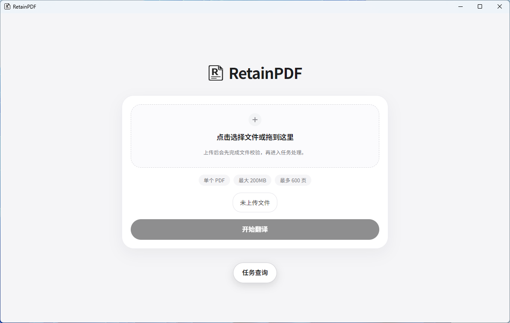
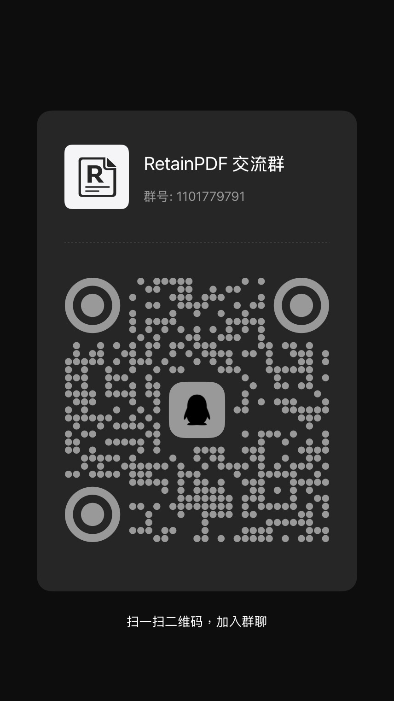

# RetainPDF: PDF Layout-Preserving Translation Tool

<p align="center">
  
</p>


There are quite a few layout-preserving projects in the open-source community, but they all focus on copyable, editable PDFs and scenarios with simple inline formulas.

RetainPDF was designed from the ground up to solve layout-preserving translation for all types of PDFs, especially image-based/scanned PDFs and inline formula rendering.

In the field of layout-preserving translation, it goes head-to-head with closed-source models and does better in some scenarios, such as translated PDF file size, overall speed, and font size control.

Additionally, this project is a full-stack project with separated frontend and backend, integrating OCR, translation, layout, and delivery. The overall structure is designed to be decoupled, making it easy to use directly as well as convenient for developers to extend, replace modules, and build upon.


Simple comparison:

| Project | Scanned PDF | Complex Inline Formulas | Code Not Mistranslated | Table Control | Custom Translation Strategy | Layout Preservation | PDF Compression Optimization | API Automation |
| --- | --- | --- | --- | --- | --- | --- | --- | --- |
| PDFMathTranslate | ❌ | ❌ | ❌ | Weak | Weak | Average | Average | ✅ |
| PolyglotPDF | ❌ | ❌ | ❌ | Weak | Weak | Average | Average | ✅ |
| Doc2X | ✅ | ✅ | ❌ | Medium | Weak | Strong | Weak | ❌ Not available |
| RetainPDF | ✅ | ✅ | ✅ | ✅ Toggleable | ✅ Configurable by rules | Strong | ✅ Continuously optimized | ✅ |

## Demo

### SCI Papers

<p align="center">
  
</p>

<p align="center">
  
</p>

### Image-Based / Scanned PDFs

<p align="center">
  
</p>

<p align="center">
  
</p>

### Books

<p align="center">
  
</p>

<p align="center">
  
</p>

<p align="center">
  
</p>

## Quick Start

If you just want to use it directly, go to [GitHub Releases](https://github.com/wxyhgk/retain-pdf/releases) to download the release package for your platform:

- Windows: Prefer downloading `Setup.exe`
- macOS: Download `.dmg`
- Linux: Download `.deb`

If you want to use it for LAN, team, or multiple devices, Docker deployment is recommended.

### Windows Desktop

<p align="center">
  
</p>

### macOS Note

Since there is currently no Apple Developer account, the macOS version may show a "damaged" prompt when first opened. This is not actual file corruption, but caused by the system's signature verification. After dragging the application to `/Applications`, run:

```bash
sudo xattr -r -d com.apple.quarantine /Applications/RetainPDF.app
```

Then reopen the application.

### Docker Deployment

The repository provides a Docker delivery directory:

- [docker/delivery/README.md](docker/delivery/README.md)
- [docker/delivery/docker-compose.yml](docker/delivery/docker-compose.yml)

Basic steps:

```bash
git clone https://github.com/wxyhgk/retain-pdf.git
cd retain-pdf/docker/delivery
docker compose up -d
```

After startup, the default access address:

```text
http://127.0.0.1:40001
```

Default ports:

- `40001`: Frontend page
- `41000`: Rust API
- `42000`: Convenience sync interface

### Docker Update

If you just want to update to the latest image version:

```bash
cd retain-pdf/docker/delivery
docker compose pull
docker compose up -d
```

If you want to switch to a specific image version:

```bash
cd retain-pdf/docker/delivery
APP_IMAGE=wxyhgk/retainpdf-app:latest \
WEB_IMAGE=wxyhgk/retainpdf-web:latest \
docker compose up -d
```

After updating, it's recommended to run a status check:

```bash
docker compose ps
```

Current image addresses:

- [wxyhgk/retainpdf-app](https://hub.docker.com/r/wxyhgk/retainpdf-app)
- [wxyhgk/retainpdf-web](https://hub.docker.com/r/wxyhgk/retainpdf-web)

## Community

If you encounter problems while using, deploying, or developing RetainPDF, feel free to join the QQ group for discussion.

- QQ Group: `1101779791`

<p align="center">
  
</p>

## Developers


### Documentation Entry Points

Recommended reading order:

- [Current API Documentation](doc/API.md)
- [Documentation Directory](doc/README.md)
- [Engineering Evaluation and Execution Plan](doc/engineering-evaluation-and-execution-plan.md)
- [Architecture Decoupling Task Ledger](doc/architecture_tasks.csv)
- [Pipeline Stage Contract](backend/scripts/runtime/pipeline/README.md)
- [Rust API Job Lifecycle](doc/rust_api/04-job-lifecycle.md)
- [Artifact Inventory and Downloads](doc/rust_api/06-artifact-inventory-and-downloads.md)
- [Service Overview](doc/api-overview.md)
- [Local Startup and Configuration](doc/api-dev.md)
- [API Endpoints](doc/api-endpoints.md)
- [Storage Structure](doc/api-storage.md)
- [Troubleshooting](doc/api-troubleshooting.md)
- [Frontend Status Smoke](doc/frontend_status_smoke.md)

### Code and Submodule Description

- [Backend Script Documentation](backend/scripts/README.md)
- `frontend/`: Browser frontend static assets and desktop packaging input directory

### Current Directory Structure

- `frontend/`
  Browser frontend, desktop shell, preview experiment pages.
- `backend/`
  Rust API, Python scripts, embedded Python, historical workspace.
- `docker/`
  Dockerfile, release scripts, delivery compose configuration.
- `data/`
  Local run output, task directories, historical sample data.

### Current Project Status

RetainPDF can currently complete the full pipeline from PDF upload, OCR, translation, layout reconstruction, to artifact download.

The next focus is not on blindly adding features, but on continuing to solidify the following:

- Engineering consistency
- API and artifact contract stability
- Build reproducibility
- Translation stability in long text blocks and formula scenarios

If you want to understand how I plan to proceed, see:

- [Engineering Evaluation and Execution Plan](doc/engineering-evaluation-and-execution-plan.md)

### Welcome to Contribute

If you're also interested in the following directions, welcome to continue pushing this project forward:

- High-precision OCR / complex layout parsing
- Translation stability in long text blocks and formula scenarios
- Layout backfill, font adaptation, and PDF rendering
- Desktop, Docker delivery, and engineering refinement

Whether you're more skilled in algorithms, frontend, backend, or deployment, as long as you want to make "truly usable PDF layout-preserving translation" a reality, welcome to join in.

## License

This project is distributed under the MIT License. See [LICENSE](LICENSE) for the full text.
